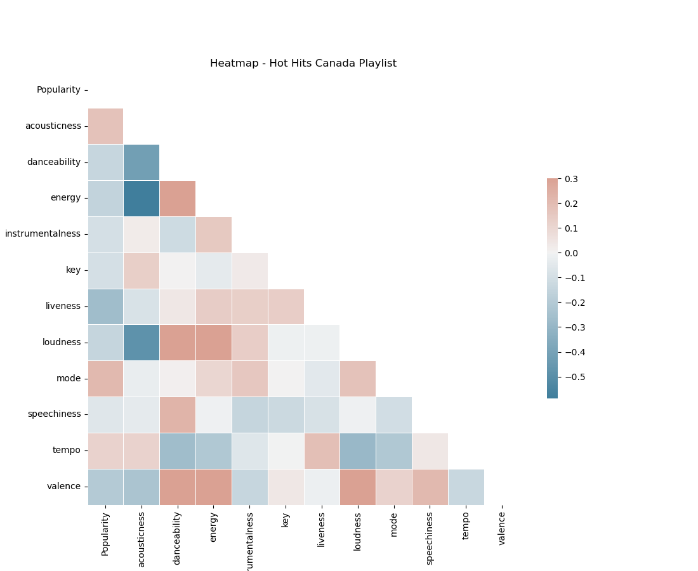

# Lyrical Sentiment Analysis
## Brandon Rose
### Jan 10 2023

----------------------------------------
## Overview
The goal for this mini project is to further explore SpotipyAPI, this time applying Natural Language Processing (NLP) models for sentiment analysis of lyrics in Canada's Spotify generated hits playlist. The chosen playlist is "Hot Hits Canada", a playlist that contains 75 of the most played tracks in the country on the app. 

----------------------------------------

## Tech Stack
**REST**: [SpotifyAPI](https://developer.spotify.com/), [GeniusAPI](https://docs.genius.com/#/getting-started-h1)
 **Packages**: [BeautifulSoup4](https://beautiful-soup-4.readthedocs.io/en/latest/), [Pandas](https://pandas.pydata.org/docs/), [Requests](https://requests.readthedocs.io/en/latest/), [Regex](https://docs.python.org/3/library/re.html)
 **Encoding**: [Base64](https://docs.python.org/3/library/base64.html)

----------------------------------------

## Playlist Used:
[Hot Hits Canada - Spotify Generated](https://open.spotify.com/playlist/37i9dQZF1DWXT8uSSn6PRy?si=7317a27a09cc48a6)

----------------------------------------

## Process
## Part 1: Data Collection/EDA
- #### Using Spotipy, extract the basic song data from the chosen playlist (Trackname, Artist, Popularity & Tracklink). Create additional empty 'lyrics' column. Save to [song_data.csv](data/song_data.csv).
- #### Additionally, use the tracklinks from first csv to pull each track's audio analysis data with the same API class. Save this to [audio_features.csv](data/audio_features.csv).
- #### Conduct basic dataviz on audio features for Canada's top 75 tracks (seaborn heatmap). This will give insight on relationships between the tracklist's audio features:

## Part 2: Lyric Retrieval
- #### Using Genius API, build a function that pulls the unique lyric url from each search endpoint. 
- #### Append lyric url to song_data.csv dataframe.
- #### Using beautiful soup, retreive the lyrics from their respective urls and clean with regex, append to 'Lyrics' column of song_data.csv
